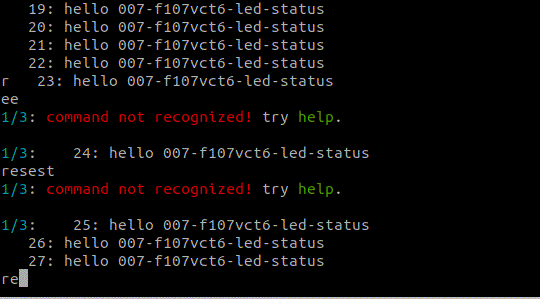

### Example Projects

#### `001-f107vct6-sysclk-led`

Basic project to setup the system clock (not the SysTick) and Toggle a LED in a while loop.

#### `002-f107vct6-stime`

Setup the SysTick to 4KHz/2KHz/1Khz/500Hz/400Hz/200Hz, and toggle a GPIO pin in `SysTick_Handler()` (need to add it manually in `core-stime.c`, since it is not a part of the library). Configure the module `stime` in `config.h` as:

```c
#define _STIME_USE_SYSTICK
#define _STIME_2K_TICK
#include "stime-scheduler.h"
```

#### `003-f107vct6-console-printf`

Setup a UART/USART port as the console, and use the console to print data, just like use it as `printf()` in `stdio.h`.

* The example code uses `UART5` on PC12 (TXD) and PD2 (RXD) as the console, configure it in `config.h` as:

  ```c
  #define _CONSOLE_USE_UART5_PC12PD2
  #include "uart-console.h"
  ```

* Color `printf()` is used in this example. Use `screen /dev/ttyUSB0 921600` to see its color effect.

#### `004-f107vct6-stime-delay`

This project demos the delay functions using the delay functions in `stime`, and print the time difference in the terminal.

Notice that these delay functions would block the program.

#### `005-f107vct6-stime-scheduler`

This project uses the module `stime ` as a task scheduler. To enable it, just add:

```c
#define _STIME_USE_SCHEDULER
```

#### `006-f107vct6-console-cli`

This project demonstrate the interaction from `screen` with the micro-controller using the built in `cli`. On the other hand, this project uses:

1. `scheduler` module to manage the tasks;



#### `007-f107vct6-led-status`

This project is based on previous example project, and add the following:

1. `led-status` module to run the heartbeat task.